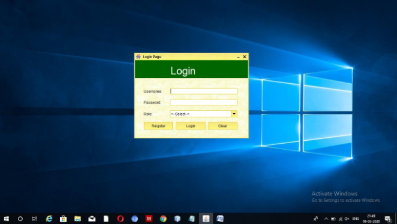
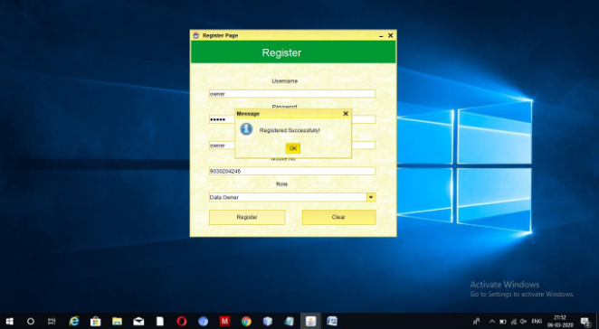
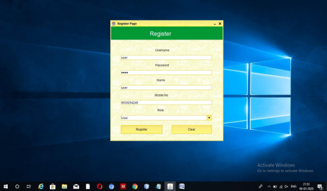
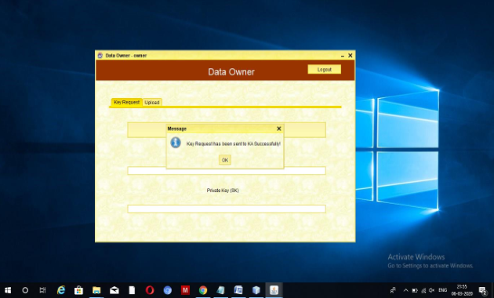
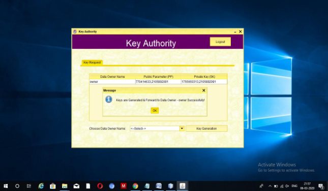
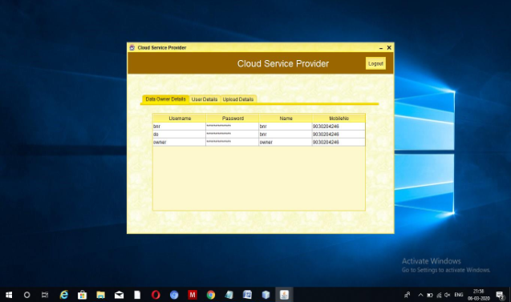
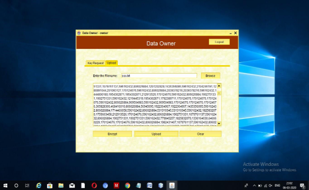
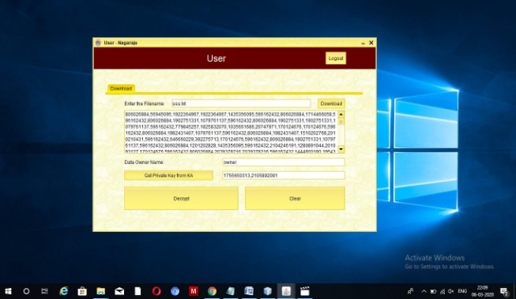
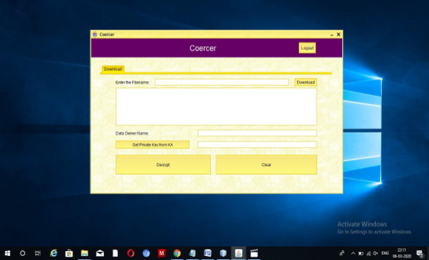
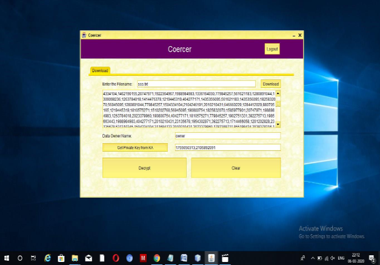

# A Deniable CP-ABE Scheme to Build Cloud Storage Service
  This work is aimed at enhancing data privacy and security in cloud environments.

## About Project

In today's digital era, cloud computing has become essential, but it raises major security concerns. **Traditional CP-ABE schemes** provide access control but fail under coercion attacks, where users may be forced to reveal their keys. 

To overcome this, my project integrates **CP-ABE with deniability**, allowing users to generate fake keys under pressure, thus protecting their privacy and trust in cloud storage.

## Technologies

- **Operating System :** Windows 7,8,10
- **Programming Language :** Java (jdk8.0)
- **IDE :** Net Beans 8.0
- **Data Base :** MySQL 5v

## Screenshots

**Login page**

---

**Data owner registration**

---

**User Registration**

---

**Data owner key request and upload file**

---

**Key Authority Screen**

---

**Cloud Service Provider Screen**

---

**File Upload Data Owner**

---

**User Download File**

---

**Decrypt Data**

---

**Coercer Screen**

---

**File Download And Show Fake Data**

